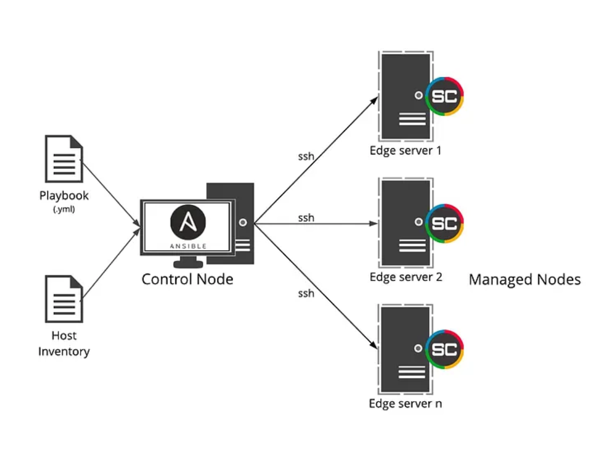

# Ansible Learning Documentation (Day - 6)

---

## Objective

The main objective of this task is to automate server configuration and deploy applications using Ansible as a configuration management and automation tool.

---

## Ansible Overview

Ansible is an open-source automation platform used for managing IT infrastructure and deploying applications efficiently.

### Ansible is commonly used for:

1. Configuration Management  
2. Application Deployment  
3. Infrastructure Provisioning  
4. Task Orchestration  

Ansible works using SSH and does not require any agent installation on remote machines.



---

## Installation

### Installing Ansible on Ubuntu

Follow the below commands to install Ansible on an Ubuntu machine:

```bash
sudo apt update
sudo apt install software-properties-common
sudo add-apt-repository --yes --update ppa:ansible/ansible
sudo apt install ansible
